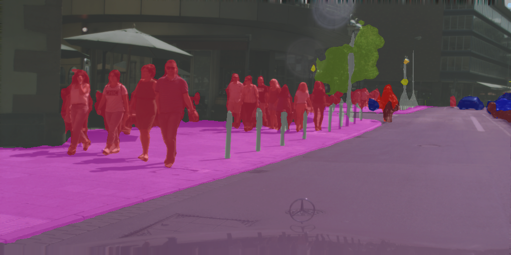
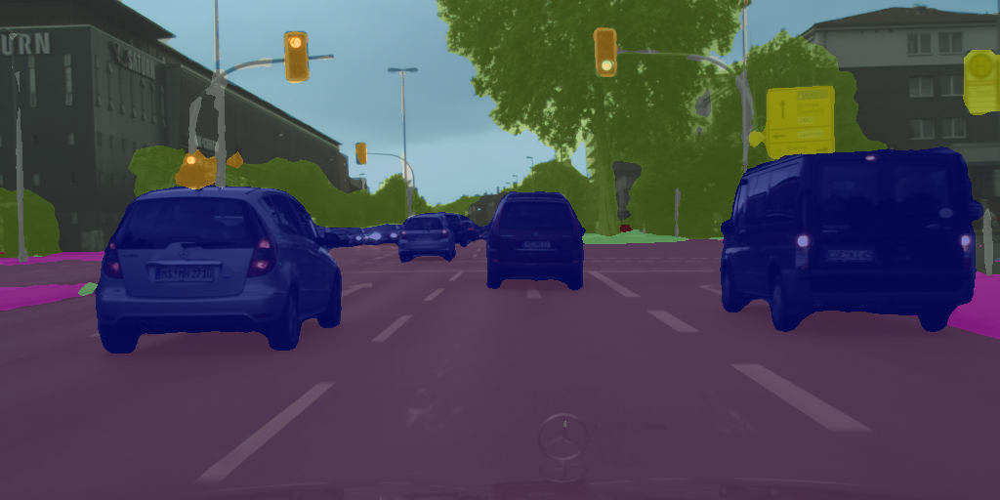

# HoloSeg
> This is the  official implementation of "HoloSeg: An Efficient Holographic Segmentation Network for Real-time Scene Parsing" (PyTorch) (ICRA 2022)





## Under Construction
- [x] Prediction code
- [x] Cityscapes weights
- [ ] Training code
- [ ] TensorRT implementation

## Install

Dependencies:
- pytorch
- torchvision
- pyyaml
- einops
- ptflops
- numpy
- opencv-python
- albumentations

You can install all these by:
```
pip install -r requirement.txt
```

## Predict an Image
```
python predict.py --image_path /path/to/image.png
```

## Citation
If you find this repository is useful for your research or application, please consider citing our paper:

```
@inproceedings{li2022holoseg,
  title={HoloSeg: An Efficient Holographic Segmentation Network for Real-time Scene Parsing},
  author={Li, Shu and Yan, Qingiqng and Liu, Chengju and Chen, Qijun},
  booktitle={IEEE International Conference on Robotics and Automation (ICRA)},
  year={2022}
}
```